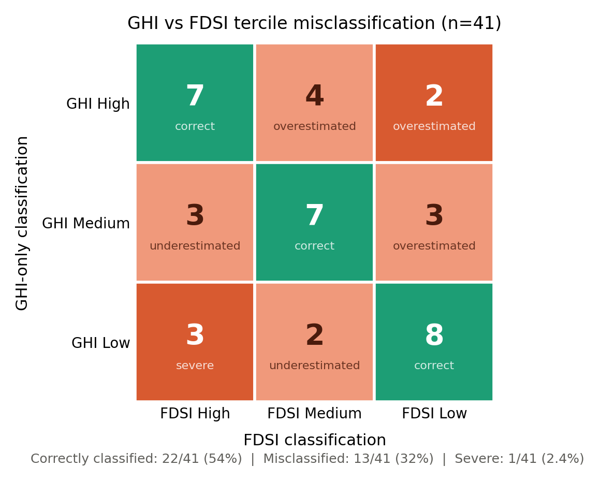
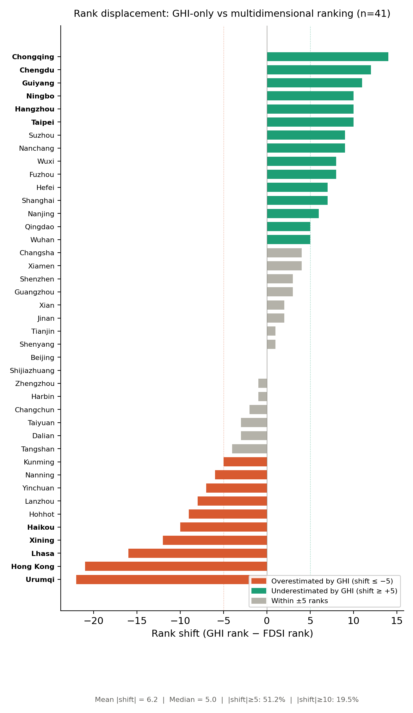
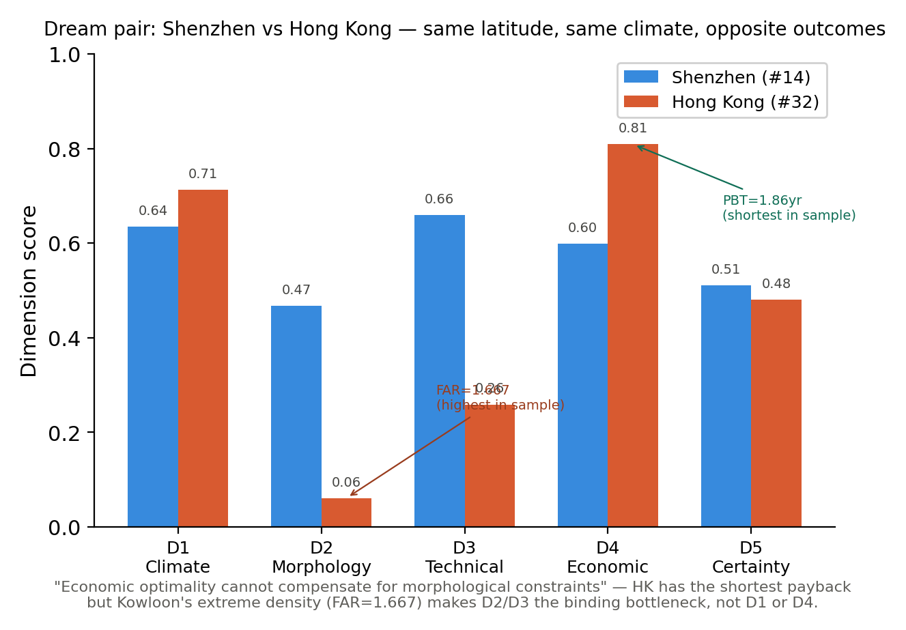
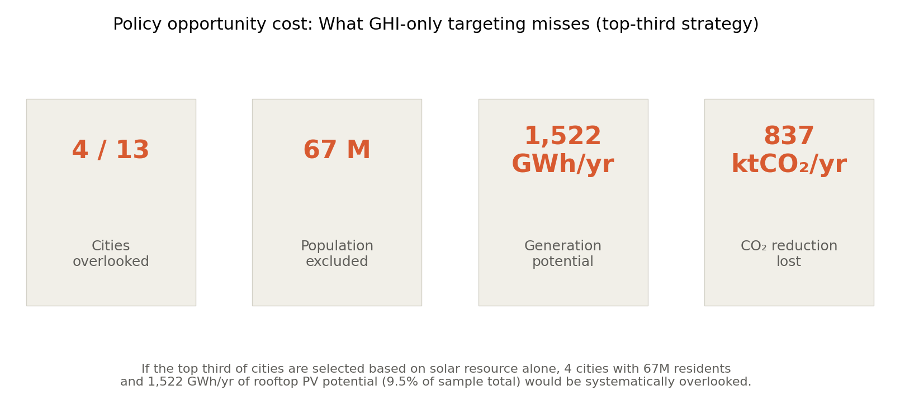
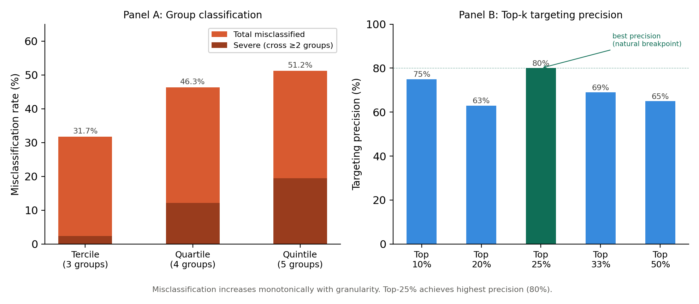

# Paper 4 NC — GPT 反馈后的分析升级报告

**日期**: 2026-04-09  
**项目**: multi-cities-bipv-nc  
**样本**: 41 城市 (39 内地 + 香港 + 台北)  
**冻结主 Claim**: Using irradiance alone to prioritize urban residential rooftop PV systematically misclassifies city suitability.

---

## 一、GPT 反馈与响应总结

将 Paper 4 NC 的完整 progress summary 提交给 GPT 审阅后，GPT 给出了六条核心意见。以下逐条记录我们做了什么、得到了什么结果。

### 1. "FDSI 不应该是主角，误分类才是"

**GPT 原话要点**: 论文读起来像 framework application 而不是 discovery paper。NC 编辑会问 "what is the generalizable phenomenon?"。建议将论文重心从 "我们开发了一个框架" 转向 "irradiance-first planning systematically misclassifies city rooftop PV opportunity"。

**我们的响应**: 编写并运行了 `nc_02a_misclassification.py`，将 FDSI 排名表转化为四组可量化的误分类证据：三分位混淆矩阵、排名偏移分布、极端案例识别、政策误导模拟。

**结果**:
- 三分位误分类率 31.7% (13/41 城市)
- GHI 无法捕获的排名变异 42.2% (Spearman r_s = 0.760)
- 中位排名偏移 5.0 位，最大 22 位 (乌鲁木齐)
- 51.2% 城市的排名偏移 ≥ 5 位
- 政策模拟：按 GHI 前 1/3 优先投放会遗漏 4/13 高适宜城市

**影响**: 论文研究问题从 "哪些城市适合 BIPV" 升级为 "为什么用 GHI 选城市会系统性选错"。FDSI 从发明对象降格为识别工具。

### 2. "需要鲁棒性/falsification 章节"

**GPT 原话要点**: NC 审稿人会质疑 "结论是否只因为选了特定的权重和维度"。即使用了 entropy+AHP，最终排名仍可能被视为 researcher-authored。需要展示核心发现在不同权重方案、去除维度、数据驱动方法下依然成立。

**我们的响应**: 编写并运行了 `nc_02b_robustness.py`，测试五种替代方案：原始权重、等权(各0.20)、去D5、去D4、PCA纯数据驱动。每种方案检验两个标准：核心发现存活 (r_s vs GHI < 0.85) 和排名稳定 (r_s vs 原始 > 0.80)。

**结果**:
- 全部 5 种方案均通过核心发现检验 (r_s = 0.71–0.78, 均 < 0.85)
- 6 个城市在所有方案下都被 GHI 误分类：Beijing, Changsha, Guangzhou, Qingdao, Harbin, Hong Kong
- 可写入正文："This finding is robust to alternative index constructions including equal weighting, dimension removal, and data-driven PCA composites."

**影响**: 预防了 "这只是一个特定指数的产物" 这个最常见的 composite index 论文致命伤。6 个持续误分类城市是最硬的证据。

**补充预防** (审稿人可能反打 "去掉 D4/D5 还稳，为什么需要五维？"): 五维框架不是为了让误分类存在（四维下也存在），而是为了诊断误分类的来源——D4 识别经济拖累，D5 识别评估不确定性。去掉它们核心发现还在，但失去了解释 "为什么错" 和 "政策应该怎么补" 的能力。

### 3. "城市形态独立于地理的 claim 需要更硬的证据"

**GPT 原话要点**: Moran's I 对 D2 不显著虽有趣但不够。建议用城市配对做 "自然实验" 式论证——同气候不同形态、同形态不同气候、同 GHI 不同 FDSI。

**我们的响应**: 编写并运行了 `nc_02c_cross_pairs.py`，系统搜索三类控制变量配对。同时加入香港和台北 (41城)，获得了深圳 vs 香港这个 dream pair。

**结果**:

| 配对类型 | 城市对 | 控制变量 | 关键差异 | 解读 |
|---------|--------|---------|---------|------|
| Type C (控GHI) | 长沙 vs 成都 | GHI差仅86 kWh/m² | FDSI排名差23位 | 相同资源 ≠ 相同适宜性 |
| Type B (控气候) | 南昌 vs 重庆 | 同HSCW区 | FDSI gap = 0.370 | 形态独立于地理 |
| Type A (控形态) | 重庆 vs 拉萨 | 形态相同 | FDSI差0.573 | 气候+经济联合效应 |
| Dream Pair | 深圳 vs 香港 | 同纬度、同气候、GHI差87 | FDSI排名#14 vs #32 | 经济性无法补偿形态劣势 |

**影响**: 深圳 vs 香港成为论文最有说服力的单一证据——香港拥有全样本最短回收期 (1.86yr) 但九龙极高 FAR (1.667) 使其排名第32。"Economic optimality cannot compensate for morphological constraints."

### 4. "情景分析应该是政策反事实，不只是四根柱子"

**GPT 原话要点**: 最好的结果不是 "降成本能提升很多城市"，而是量化 "为什么碳价传导弱、成本下降传导强"。

**我们的响应**: 在误分类框架下重新定位情景分析的角色——它回答的不是 "未来会怎样"，而是 "误判有多重要"。编写 `nc_02d_policy_cost_and_sensitivity.py` 将机会成本翻译为物理量。

**结果** (按 GHI 前 1/3 优先部署被遗漏的潜力):

| 指标 | 数值 |
|------|------|
| 被遗漏城市数 | 4 / 13 |
| 被遗漏装机容量 | 1,157 MW |
| 被遗漏年发电量 | 1,522 GWh/yr |
| 被遗漏年减排量 | 837 ktCO₂/yr |
| 被遗漏人口 | 6,700 万人 |
| 占样本总潜力比例 | 9.5% |

**摘要句**: "If the top third of cities are selected for priority deployment based on solar resource alone, 4 cities with 67 million residents and an estimated 1,522 GWh/yr of rooftop PV potential would be systematically overlooked."

### 5. "收紧样本逻辑"

**GPT 原话要点**: 不要让 39 城读起来像 "我们选了所有能选的"。框架化为有意为之的 sampling design。

**我们的响应**: 加入香港和台北 (41城)，覆盖 5 个气候区 + 3 种制度环境 (内地/香港/台湾)。深圳 vs 香港作为 "制度控制变量" 的自然实验是 39 城版本做不到的。

**结果**: 样本叙事从 "39个中国内地城市" 升级为 "41 cities spanning five climate zones, four city-size tiers, and three institutional environments (mainland China, Hong Kong SAR, and Taipei)"。东南亚城市不加（参数体系需全面重建、叙事焦点会散），留给下一篇论文。

### 6. "分类敏感性需要 SI 支撑"

**GPT 原话要点**: 33% 误分类率的定义需要在 supplement 中用 tercile/quartile/quintile/top-k 多方案验证。45.4% "非资源因素解释" 的表述要谨慎。

**我们的响应**: 在 `nc_02d_policy_cost_and_sensitivity.py` 中加入完整敏感性分析。

**结果**:

| 方案 | 误分类率 | 严重误分类 (跨≥2组) |
|------|---------|-------------------|
| Tercile (3组) | 31.7% | 2.4% |
| Quartile (4组) | 46.3% | 12.2% |
| Quintile (5组) | 51.2% | 19.5% |

- 误分类率随粒度单调递增 → 支持用粗粒度 (High/Med/Low) 做政策分组
- Top-25% 靶向精度最高 (80%) → 自然断点
- 正文措辞调整："42.2% of rank variation is not captured by irradiance alone"（而非 "来自非资源因素"）

---

## 二、核心图表

### Fig. 1: GHI vs FDSI 三分位误分类矩阵

31.7% 的城市被 GHI-only 策略分到错误的适宜性等级。对角线为正确分类 (22/41)，非对角线为误分类 (13/41)。GHI High → FDSI Low 的 2 个严重误分类城市包括乌鲁木齐和拉萨。

---

### Fig. 2: 排名偏移分布

41 城市按 GHI rank − FDSI rank 排列。红色 = GHI 高估 (shift ≤ −5)，绿色 = GHI 低估 (shift ≥ +5)，灰色 = 偏移 < 5。乌鲁木齐 (−22) 和香港 (−21) 是最大的高辐照陷阱；重庆 (+14) 和成都 (+12) 是最大的隐藏冠军。51.2% 城市偏移 ≥ 5 位。

---

### Fig. 3: 鲁棒性检验

5 种替代指数构造方案均通过两项检验：(1) 核心发现存活 (r_s vs GHI < 0.85)，(2) 排名稳定 (r_s vs 原始 > 0.80)。6 个城市在所有方案下持续被误分类：Beijing, Changsha, Guangzhou, Qingdao, Harbin, Hong Kong。

---

### Fig. 4: Dream Pair — 深圳 vs 香港

同纬度 (22.3°N)、同气候 (HSWW)、GHI 差仅 87 kWh/m²，但 FDSI 排名 #14 vs #32。香港拥有全样本最短回收期 (PBT=1.86yr) 和最高 D4 经济性得分 (0.809)，但九龙的极端 FAR (1.667, 全样本最高) 压制了 D2 (0.061) 和 D3 (0.259)。结论：经济性无法补偿形态劣势。

---

### Fig. 5: 政策机会成本 (物理量)

按 GHI 前 1/3 优先部署 BIPV 会遗漏 4 个真正高适宜城市，涉及 6,700 万人口、1,157 MW 装机容量、1,522 GWh/yr 年发电潜力和 837 ktCO₂/yr 减排量，占样本总潜力的 9.5%。

---

### Fig. 6: 分类敏感性分析

Panel A: 误分类率随分类粒度单调递增 (tercile 32% → quartile 46% → quintile 51%)，支持用粗粒度做政策分组。Panel B: Top-25% 靶向精度最高 (80%)，是 GHI-FDSI 一致性的自然断点。

---

## 三、Results 正文结构 (冻结)

### §1: Misclassification exists and is quantifiable
- 混淆矩阵 + rank shift 分布 (Fig.1, Fig.2)
- r_s = 0.760, 42.2% unexplained
- 敏感性检验 → SI (Fig.6)

### §2: Misclassification is not an artifact of index construction
- 5 种替代方案全 PASS (Fig.3)
- 6 个持续误分类城市
- "为什么五维" 的预防性论证

### §3: Urban morphology and economics independently drive the reordering
- 回归 standardized β: GHI (+0.091***) > FAR (−0.031***) > Shading (+0.030**)
- Cross-pair 对比 (Fig.4): 长沙 vs 成都, 深圳 vs 香港, 南昌 vs 重庆
- Moran's I: D2 空间随机 → 形态效应不是地理的影子

### §4: The misclassification has quantifiable policy consequences
- 1,522 GWh/yr + 67M 人口被遗漏 (Fig.5)
- 情景分析: 成本下降是钥匙，碳价不是
- 重庆 = 物理极限标尺

---

## 四、关键数字速查表

| 数字 | 用于 | 正文/SI |
|------|------|---------|
| r_s = 0.760 | 核心相关 | 正文 §1 |
| 42.2% unexplained | 核心发现 | 正文 §1 |
| 31.7% 误分类率 | 主结果 | 正文 §1 |
| 51.2% 城市 \|shift\|≥5 | 支撑 | 正文 §1 |
| 6 持续误分类城市 | 鲁棒性 | 正文 §2 |
| 长沙 vs 成都: ΔGHI=86, Δrank=23 | 最强证据 | 正文 §3 |
| 深圳 vs 香港: PBT 3.52 vs 1.86 | Dream pair | 正文 §3 |
| 1,522 GWh/yr 被遗漏 | 政策成本 | 正文 §4 / 摘要 |
| 67M 人口 | 政策成本 | 正文 §4 / 摘要 |
| 837 ktCO₂/yr | 政策成本 | 正文 §4 |
| Top-25% 精度 80% | 政策建议 | Discussion |
| R²=0.929 (回归) | 框架解释力 | 正文 §3 |
| Moran's I=0.214 (p=0.014) | 空间集聚 | 正文 §3 |

---

## 五、待确认事项

- [ ] 鲁棒性表中替代方案的精确 r_s 值 (02b 脚本输出，标 ~ 的需替换为精确值)
- [ ] 屋顶面积估算方法确认 (building_density × study_area vs 直接字段)
- [ ] 港台的 PVGIS 数据源确认 (ERA5 vs SARAH2)
- [ ] 导师对 41 城 vs 42 城 (是否加澳门) 的意见
- [ ] Discussion 中港台政治表述的措辞审核
- [ ] 情景分析是否需要对 41 城重跑 (目前基于 39 城)

---

## 六、产出文件清单

### 脚本
- `scripts/nc_02a_misclassification.py` — 误分类核心量化
- `scripts/nc_02b_robustness.py` — 鲁棒性检验 (5种替代方案)
- `scripts/nc_02c_cross_pairs.py` — 控制变量城市配对
- `scripts/nc_02d_policy_cost_and_sensitivity.py` — 机会成本物理化 + SI敏感性

### 数据
- `results_nc/misclassification/` — 混淆矩阵、排名偏移、极端案例
- `results_nc/robustness/` — 替代方案比较、持续误分类城市
- `results_nc/cross_pairs/` — 三类配对分析
- `results_nc/policy_cost/` — 物理量机会成本
- `results_nc/sensitivity/` — 分类敏感性 (SI)

### 图表
- `figures/fig1_confusion_matrix.png` — 三分位混淆矩阵
- `figures/fig2_rank_shift.png` — 排名偏移分布
- `figures/fig3_robustness.png` — 鲁棒性检验
- `figures/fig4_dream_pair.png` — 深圳 vs 香港
- `figures/fig5_opportunity_cost.png` — 政策机会成本
- `figures/fig6_sensitivity.png` — 分类敏感性
